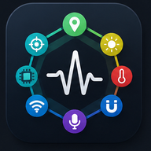
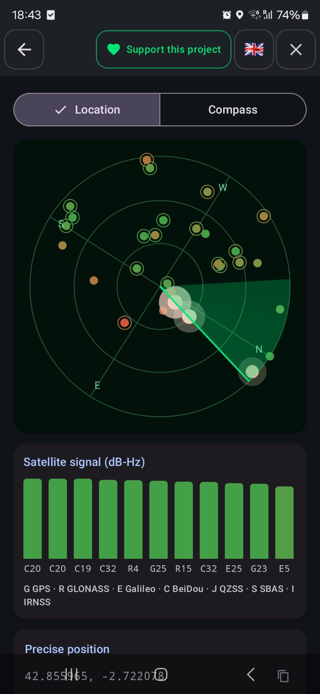
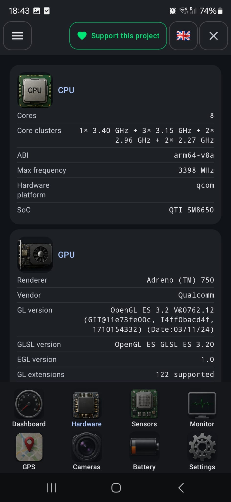
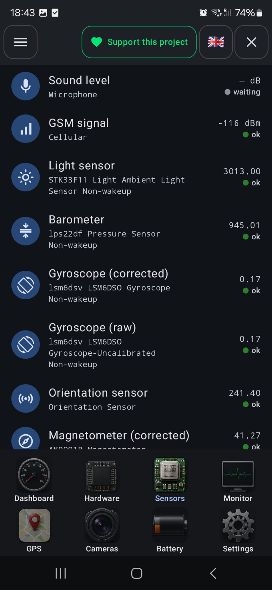
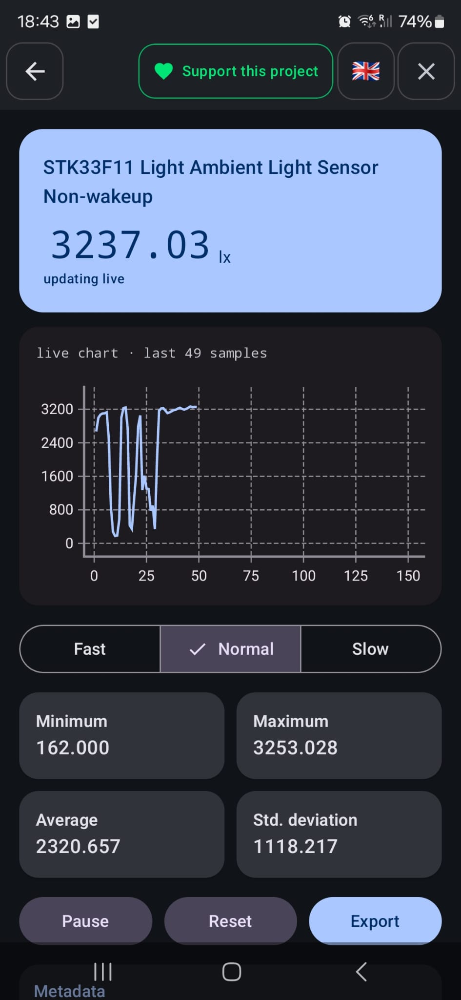
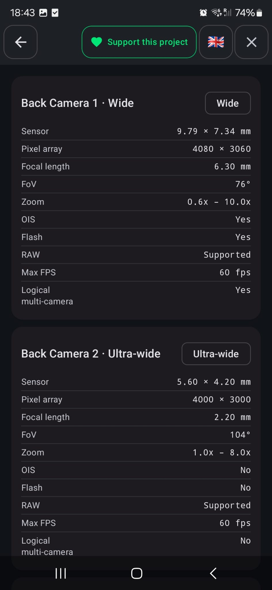
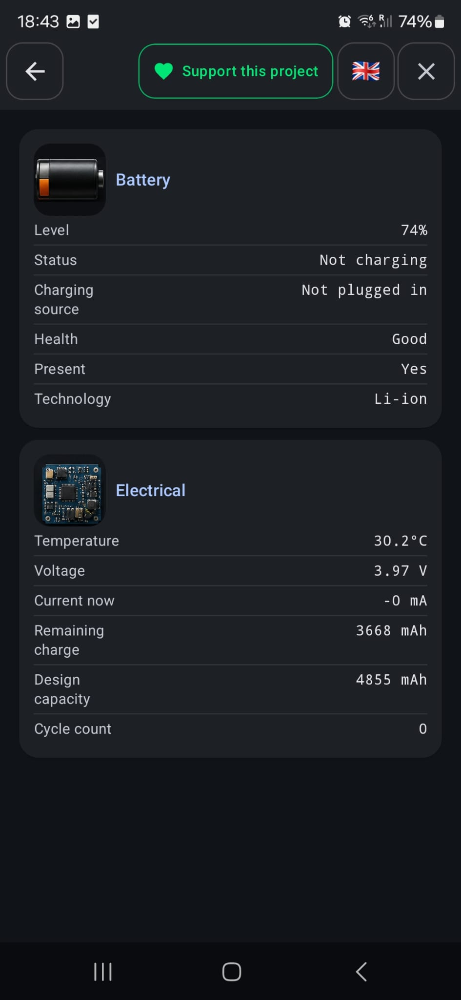
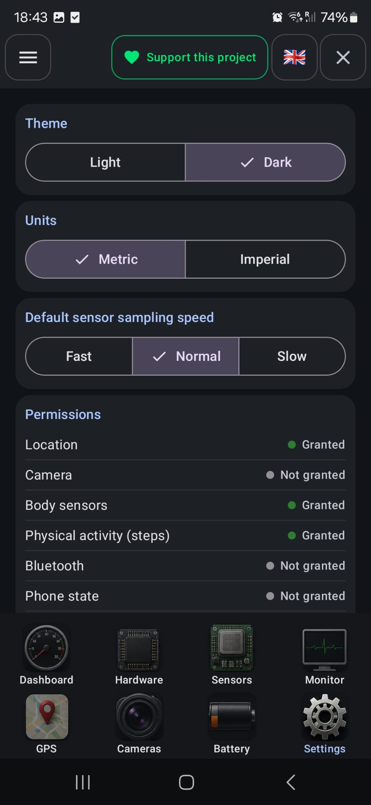

# LabDroid

<p align="center">
  
</p>

<p align="center">
  A free, ad-free Android app that shows what your phone really has inside: every sensor live with charts, CPU and GPU details, cameras, battery health, GPS satellites and connectivity - read entirely on-device, with no accounts, no cloud, no analytics and no internet permission.
</p>

<p align="center">
  <a href="https://spotrobotics.app/labdroid/">Presentation page</a>
  &nbsp;|&nbsp;
  <a href="https://github.com/moskil2/LabDroid/releases">Download</a>
  &nbsp;|&nbsp;
  <a href="https://spotrobotics.app/support/">Support</a>
</p>

<table align="center">
  <tr>
    <td></td>
    <td></td>
    <td></td>
    <td></td>
  </tr>
  <tr>
    <td></td>
    <td></td>
    <td></td>
    <td></td>
  </tr>
</table>

<p align="center">Found a bug or have an idea? <a href="https://github.com/moskil2/LabDroid/issues">Open an issue</a> or reach out through the <a href="https://spotrobotics.app/support/">support page</a>.</p>

- Package: `com.labdroid.app`
- Minimum Android version: 8.0 Oreo (API 26), targets Android 16 (API 36)
- Languages: English, Polish
- Author: Tomasz Pieczara ([spotrobotics.app](https://spotrobotics.app))

## Features

### Dashboard
- Device model, manufacturer, Android version and codename, security patch level, kernel and build number at a glance.

### Hardware
- **CPU** - cores, core clusters with their clock speeds, ABI, max frequency, hardware platform and SoC.
- **GPU** - renderer, vendor, OpenGL ES / GLSL / EGL versions, GL extensions count, max texture and viewport size, Vulkan hardware level and Vulkan compute.
- **RAM and storage** - total, used and available memory, cached, buffers, swap, per-app memory limits, low-RAM device flag, internal and removable storage.
- **Display** - resolution, density, screen diagonal, supported refresh rates, HDR and wide color gamut.
- **Audio, flashlight** and other hardware details.
- **Network, Wi-Fi, Cellular (GSM), Bluetooth and NFC** - connection type, Wi-Fi details, operator code, signal strength, data connection state, network country, Bluetooth LE / LE Audio support and paired device names.

### Sensors
- Every hardware sensor your phone exposes, with the vendor's own chip name and a live value.
- Corrected and raw variants (gyroscope, magnetometer, accelerometer) labeled and listed side by side.
- **Sound level** - a microphone-based pseudo-sensor in dB (audio is measured live and never recorded).
- **GSM signal** - live cellular signal strength in dBm.
- **Sensor detail** - live chart, minimum / maximum / average / standard deviation, sensor metadata (vendor, resolution, range, power, reporting mode), separate X/Y/Z values and a 3-line chart for raw motion sensors.
- Sampling speed: Fast, Normal (10 updates/s) or Slow (1 update/s); pause, reset and export.

### Monitor and export
- Pin the sensors you care about and record a session of all of them together.
- Export recordings to CSV, JSON, XML, TXT or GPX and share them with any app you choose.

### GPS
- Satellite radar and signal strength for GPS, GLONASS, Galileo, BeiDou, QZSS, SBAS and IRNSS.
- Precise position (decimal and degrees/minutes/seconds, copyable), altitude, speed, bearing, horizontal and vertical accuracy, satellites in use.
- Compass with true-north correction.
- Track recording with GPX / CSV export.

### Cameras
- Each camera module listed separately (wide, ultra-wide, telephoto, front) with sensor size, pixel array, focal length, field of view, zoom range, OIS, flash, RAW support, max FPS and logical multi-camera.

### Battery
- Level, status, charging source, health, technology, temperature, voltage, current, remaining charge, design capacity and cycle count.
- Values your device does not report are clearly marked as unavailable.

### Search
- Find any sensor, hardware section or setting from one search box.

### Settings
- Dark (default) or Light theme, metric or imperial units, default sensor sampling speed, export folder.
- Overview of every permission LabDroid can use, with its current state.
- Language switch (English / Polish) right from the top bar.

### Menu
- Version and build stamp, contact, website and GitHub links.
- Privacy policy, Terms of service, Android compatibility, Copyright, and a direct link to report a bug or request a feature.

## Download

LabDroid is not distributed through Google Play. The official APK is available on the **[Releases page](https://github.com/moskil2/LabDroid/releases)** of this repository. To install it, download the APK on your phone and allow installing apps from your browser or file manager when Android asks.

## Privacy

LabDroid reads sensor, location, camera and hardware data exclusively on your device, only to display it in the app or let you export it yourself. It does not request internet access at all - there are no remote servers, analytics SDKs, ad networks or crash-reporting services. The only data that leaves the device is a file you explicitly choose to export or share. Location is obtained through Google Play services' Fused Location Provider; LabDroid itself never sends it anywhere.

Full policy: [spotrobotics.app/labdroid/privacy.html](https://spotrobotics.app/labdroid/privacy.html)

## Tech stack

- Kotlin, Jetpack Compose (Material 3)
- Hilt (dependency injection)
- Room (local recording storage)
- DataStore (preferences)
- Jetpack Navigation Compose
- Vico (charts)
- Google Play services location (Fused Location Provider)

## Building

Requirements: JDK 17, Android SDK (compileSdk/targetSdk 36).

```bash
./gradlew assembleDebug
```

The debug build task automatically copies the produced APK to the project's parent directory and bumps the patch version in `app/version.properties`.

## License

Copyright (c) 2026 Tomasz Pieczara. All rights reserved. This repository is made available for viewing only - see [LICENSE](LICENSE).

## Contact

tomasz.pieczara@gazeta.pl or the [support form](https://spotrobotics.app/support/).

## Changelog

## v0.3.0 - 2026-10-02 (versionCode 49)

- New side menu: the logo and the Dark theme switch stay at the top, followed by Created by, Version and Build, Contact / Website / GitHub links, and expandable Privacy policy, Terms of service, Contact / Report bug / Feature request (with a link to the support form), Android compatibility and Copyright sections.
- The app now starts in Dark theme by default (an explicitly chosen theme is kept).
- Added a **GSM signal** pseudo-sensor (live cellular signal strength in dBm) with its own detail screen.
- Hardware: new **Cellular (GSM)** section (operator code, signal strength, data connection, network country), separate **Network**, **Wi-Fi**, **Bluetooth** (LE, LE Audio, multiple advertisement, paired device names) and **NFC** sections.
- Hardware: GPU now also shows max texture size, max viewport size, Vulkan hardware level and Vulkan compute support.
- Hardware: RAM section extended with used memory, cached, buffers, swap free, per-app memory limits and low-RAM device flag; removable storage is listed separately.
- Hardware: display section extended with density, screen diagonal, supported refresh rates and wide color gamut.
- Sensors: corrected and raw variants are now labeled "(corrected)" / "(raw)" and sorted next to each other; raw motion sensors get a detail view with separate X/Y/Z values and a 3-line chart.
- Sensors: Normal sampling speed is slower (10 updates/s) and Slow is 1 update/s, so values are easier to read.
- Sensors: the proximity sensor value is read from its first value only, fixing meaningless readings on devices that report extra values under this sensor type.
- Settings: Physical activity (steps) added to the permission overview.

## M8 - Rebrand to LabDroid, Locale/Battery/GPS-compass/Sound-level (2026-07-08)

- Renamed the project and package from TrueDroid (`com.truedroid.app`) to **LabDroid** (`com.labdroid.app`): app class, database, theme, navigation destinations/host, string resources (EN/PL), Gradle module and output APK name.
- Added English/Polish language switching (in-app locale picker).
- Added the **Battery** screen (level, health, charging source, voltage, current, temperature, cycle count).
- Added GPS **compass** with true-north correction and satellite signal radar to the GPS screen.
- Added a microphone-based **sound level** pseudo-sensor with its own detail screen.
- New app icon set and light/dark launcher/theme assets.

## M7 - Search, Settings and responsive nav rail (2026-07-05)

- Added the Search screen (sensors, hardware, settings).
- Added the Settings screen (theme, units, sampling speed, permissions, export folder, reset).
- Added a responsive navigation rail for wider screens.

## M6 - Recording + Export (2026-07-05)

- Room-backed recording of pinned sensor sessions.
- Export to CSV, JSON, XML, TXT and GPX.

## M5 - Camera info screen (2026-07-05)

- Per-camera sensor, resolution, focal length, FoV, zoom, OIS, flash and RAW details.

## M4 - GPS + Compass (2026-07-05)

- Live location screen with precise position, speed, bearing and accuracy.

## M3 - Sensors list, Sensor Detail and Live Monitor (2026-07-05)

- Full sensor list with live values.
- Per-sensor detail screen with live chart and statistics.
- Live Monitor screen for pinning sensors.

## M2 - Dashboard + Hardware with real device data (2026-07-05)

- Dashboard overview screen.
- Hardware screen: CPU, GPU, memory, storage, display, audio, connectivity.

## M1 - App shell: theme, bottom nav, 5 destinations (2026-07-05)

- Initial Compose app shell, Material 3 theme, bottom navigation with 5 destinations.

## M0 - Scaffold TrueSensor Android project (2026-07-05)

- Initial project scaffold (originally named TrueSensor, later renamed to TrueDroid and then to LabDroid).
